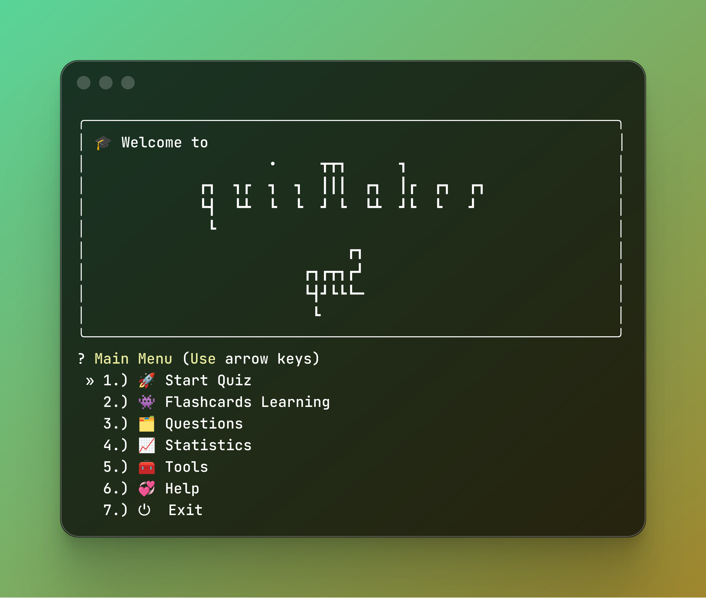
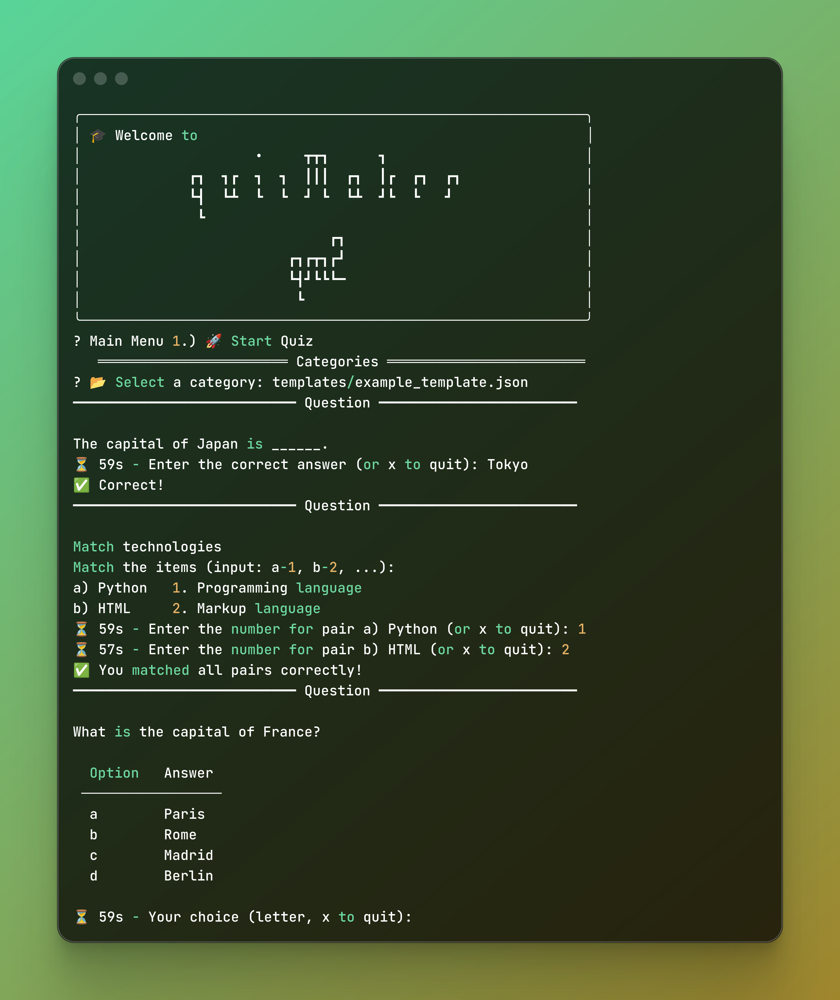
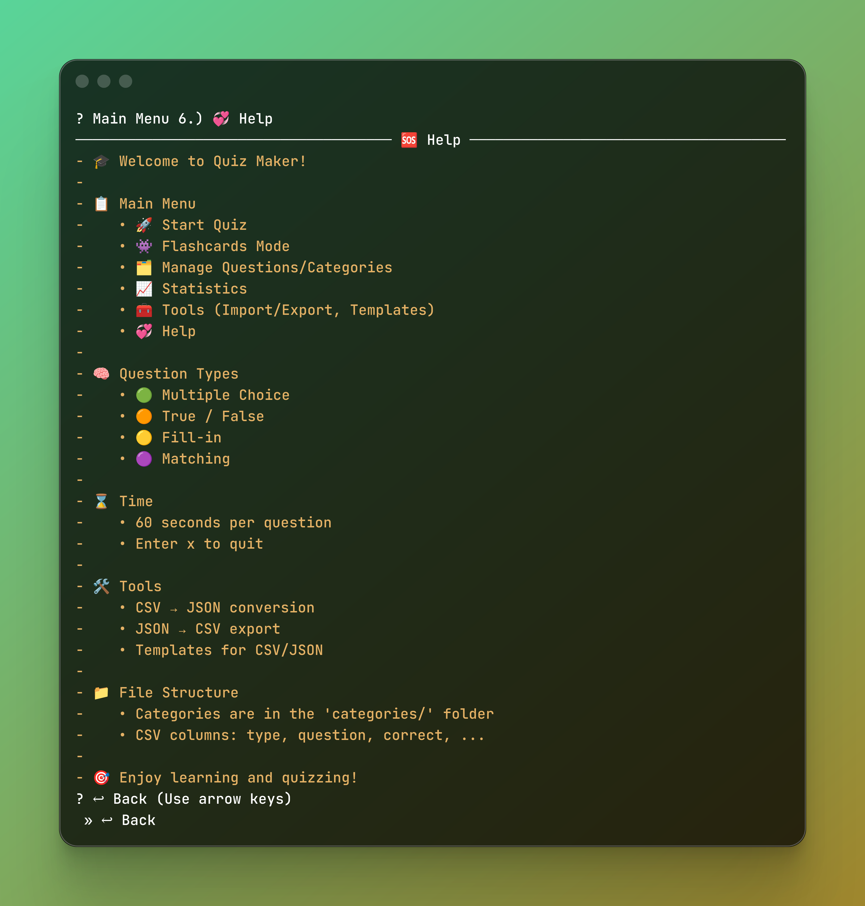

# Quiz Maker 2 (QM2) - Interactive Terminal Quiz Application

[](https://badge.fury.io/py/qm2)
[](https://pypi.org/project/qm2/)
[](https://opensource.org/licenses/MIT)
[](https://github.com/ahalvadzija/qm2)

[](https://github.com/ahalvadzija/qm2/actions/workflows/pipeline.yml)



## Overview

**Quiz Maker 2 (QM2)** is a robust, interactive terminal-based quiz engine built with Python. It is designed for developers and power users who want a professional CLI experience for learning and testing knowledge. It features a modern UI, extensive import/export capabilities, and a high-performance core.

### Key Features

- **4 Question Types**: Multiple Choice, True/False, Fill-in-the-blank, Matching
- **Timed Quiz Sessions**: Customizable timeout settings with real-time feedback
- **Flashcards Mode**: Study mode for reviewing questions without scoring
- **Score Tracking**: Comprehensive statistics and performance analytics
- **Category Management**: Organize questions into hierarchical categories
- **Import/Export**: Convert between CSV and JSON formats
- **Remote Import**: Download quiz files directly from URLs
- **Rich Terminal UI**: Beautiful, colored interface using Rich library
- **Performance Optimized**: Caching system for large question sets
- **Cross-Platform**: Works on Windows, macOS, and Linux

## Quick Start

```bash
pip install qm2
```

```bash
qm2
```

Or install from source:

```bash
git clone https://github.com/ahalvadzija/qm2.git
cd qm2
pip install -e .
```

## Screenshots

### Quiz Features

 

### Tools & Help

 

## Installation

### From PyPI (Recommended)

```bash
pip install qm2
```

### From Source

```bash
git clone https://github.com/ahalvadzija/qm2.git
cd qm2
pip install -e .
```

### Development Installation

```bash
git clone https://github.com/ahalvadzija/qm2.git
cd qm2
pip install -e ".[dev]"
```

### Docker Installation (Alternative)

If you prefer to run QM2 in an isolated environment without installing Python locally:

1. **Build the image**:
    ```bash
    docker build -t qm2 .
    ```

Run the application: Since QM2 is interactive, you must use the **-it** flags:

```bash
docker run -it qm2
```

Persist your data: To keep your **quiz data and scores** after the container stops, mount a local directory:
Bash

```bash
docker run -it -v qm2_data:/root/.local/share/qm2 qm2
```

## Usage

### Basic Usage

```bash
# Start the application
qm2

# Or if installed from source
python -m qm2
```

### Command Line Options

```bash
# Show help
qm2 --help

# Show version
qm2 --version

# Run with specific data directory
qm2 --data-dir /path/to/data
```

## Features in Detail

### Question Types

1. **Multiple Choice**: Question + correct answer + 3 wrong answers
2. **True/False**: Statement + boolean answer
3. **Fill-in-the-blank**: Question with blank + correct answer
4. **Matching**: Items to match with correct pairs

### Category Management

- Create hierarchical categories (e.g., `programming/python/basics`)
- Rename and delete categories
- Automatic directory structure creation

### Import/Export Capabilities

- **CSV ↔ JSON**: Bidirectional conversion
- **Template Generation**: Create starter templates
- **Remote Import**: Download from URLs
- **Bulk Operations**: Manage multiple files efficiently

### Performance Features

- **Caching System**: Optimized for large question sets
- **Memory Management**: Automatic cache cleanup
- **Fast Loading**: Sub-second load times for thousands of questions

## Project Structure

```text
qm2/
├── src/qm2/                # Core application package
│   ├── core/               # Business logic (engine, questions, scores)
│   ├── ui/                 # Rich terminal user interface
│   ├── utils/              # File I/O and helper utilities
│   └── __main__.py         # CLI entry point
├── tests/                  # Extensive test suite (tests)
│   ├── test_engine.py      # Core logic benchmarks
│   ├── test_performance.py # Speed & stress tests
│   └── ...                 # App, UI, and integration tests
├── docs/                   # MkDocs documentation source
│   ├── index.md            # Homepage
│   ├── guide.md            # User guide
│   └── reference.md        # Technical reference
├── examples/               # Sample JSON/CSV question sets
├── Dockerfile              # Docker container configuration
├── .dockerignore           # Docker build exclusions
├── mkdocs.yml              # Documentation site configuration
├── pyproject.toml          # Build system and dependencies
├── requirements.txt        # Development dependencies
└── README.md               # Project overview and quick start
```

### Quality Assurance & Performance

Reliability is at the heart of QM2. The project maintains an 86% coverage rate backed by a massive suite of individual tests. CI/CD pipeline ensures that every release is battle-tested.

#### Test Coverage Breakdown

- **App & UI (95+ tests)**: Comprehensive navigation testing including brute force menu traversal and submenu logic.
- **Engine & Core (45+ tests)**: Validation of all question types, session handling, and flashcards mode.
- **Validation & Security (40+ tests)**: Deep CSV/JSON schema validation and safe remote file importing.
- **Data & IO (35+ tests)**: Cross-platform path handling, concurrent file access, and encoding resilience.
- **Performance (12+ tests)**: Stress testing with large datasets and cache optimization benchmarks.

## Performance Benchmarks

QM2 is engineered for high-speed interactions and efficient resource management, verified by a dedicated performance suite:

- **Benchmarked Speed**: Processes 1,000+ questions in **< 1 second**, ensuring no lag during large quiz sessions.
- **Intelligent Caching**: Implements a caching layer that makes subsequent data loads **10x faster**.
- **Memory Efficiency**: Automatic cache cleanup prevents memory leaks during long-running sessions.
- **Thread Safety**: Verified safe concurrent file access, preventing data corruption during simultaneous read/write operations.

### Performance Testing (`tests/test_performance.py`)

- **Execution**: 12 specialized performance tests passed in **2.11s**.
- **Coverage focus**: Validated `core/engine.py` and `utils/files.py` for speed bottlenecks.

### Core Engine Testing (`tests/test_engine.py`)

- **Execution**: 23 core logic tests passed in **1.34s**.
- **Coverage**: High coverage (68%) of `src/qm2/core/engine.py`, ensuring question logic and scoring are flawless.

## How to Run Tests

```bash
# Run all tests
pytest

# Run with coverage
pytest --cov=qm2

# Run specific test categories
pytest tests/test_engine.py    # Core engine tests
pytest tests/test_questions.py # Question management tests
pytest tests/test_files.py     # File operations tests
pytest tests/test_scores.py    # Score tracking tests
pytest tests/test_performance.py # Performance tests
```

## Configuration

QM2 uses platformdirs for cross-platform data storage:

- **Linux**: `~/.local/share/qm2/`
- **macOS**: `~/Library/Application Support/qm2/`
- **Windows**: `%APPDATA%\qm2\`

### Environment Variables

```bash
# Custom data directory
export QM2_DATA_DIR="/path/to/custom/data"

# Disable colors
export NO_COLOR=1
```

## Question Format

### JSON Format

```json
[
    {
        "type": "multiple",
        "question": "What is the capital of France?",
        "correct": "Paris",
        "wrong_answers": ["Rome", "Berlin", "Madrid"]
    },
    {
        "type": "truefalse",
        "question": "Python is a programming language.",
        "correct": "True",
        "wrong_answers": ["False"]
    },
    {
        "type": "fillin",
        "question": "The capital of Japan is ______.",
        "correct": "Tokyo",
        "wrong_answers": []
    },
    {
        "type": "match",
        "question": "Match programming languages with their types",
        "pairs": {
            "left": ["Python", "JavaScript", "C++"],
            "right": ["Interpreted", "Web scripting", "Compiled"],
            "answers": { "a": "1", "b": "2", "c": "3" }
        }
    }
]
```

### CSV Format

```csv
type,question,correct,wrong_answers,left,right,answers
multiple,"What is 2+2?",4,"3,5,6","","",""
truefalse,"Earth is flat",False,True,"","",""
fillin,"Capital of Italy is ______",Rome,"","","",""
match,"Match items","","","A|B","1|2","a:1,b:2"
```

## Contributing

We welcome contributions! Please see our [Contributing Guidelines](CONTRIBUTING.md) for details.

### Development Setup

```bash
git clone https://github.com/ahalvadzija/qm2.git
cd qm2
python -m venv venv
source venv/bin/activate  # On Windows: venv\Scripts\activate
pip install -e ".[dev]"
```

### Running Tests

```bash
pytest tests/ -v
pytest --cov=qm2 tests/
```

### Code Style

```bash
black src/ tests/
isort src/ tests/
flake8 src/ tests/
```

## License

This project is licensed under the MIT License - see the [LICENSE](LICENSE) file for details.

## 💖 Acknowledgments

QM2 wouldn't be as beautiful or interactive without these amazing open-source projects:

- [Rich](https://github.com/Textualize/rich) – Powering the sleek terminal visuals, tables, and progress feedback.
- [Questionary](https://github.com/tmbo/questionary) – Providing the intuitive, user-friendly interactive prompts.

## Support

- **Email**: halvadzija.adnan@gmail.com
- **Issues**: [GitHub Issues](https://github.com/ahalvadzija/qm2/issues)

## Links

- **PyPI**: https://pypi.org/project/qm2/
- **GitHub**: https://github.com/ahalvadzija/qm2
- **Documentation**: https://ahalvadzija.github.io/qm2

---

**Created by**: [Adnan Halvadžija](https://github.com/ahalvadzija)

**⭐ If you find this project useful, please give it a star on GitHub!**
