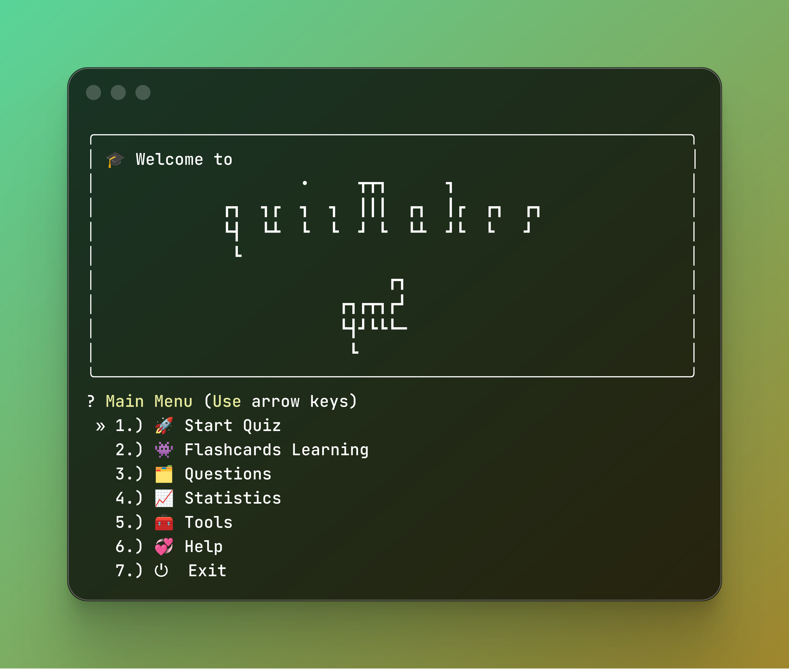
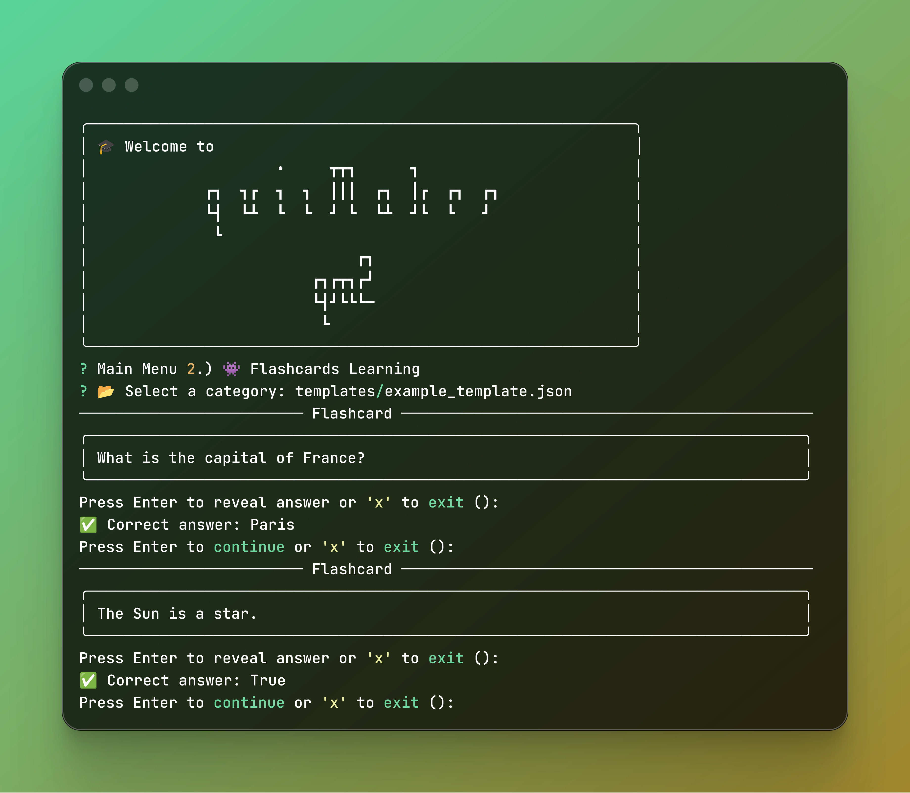
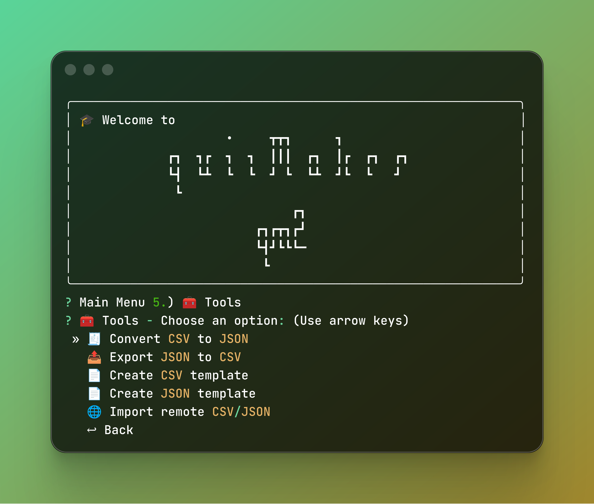

# Quiz Maker 2 (QM2) - Interactive Terminal Quiz Application

[](https://badge.fury.io/py/qm2)
[](https://pypi.org/project/qm2/)
[](https://opensource.org/licenses/MIT)
[](https://github.com/psf/black)
[](https://github.com/ahalvadzija/qm2)

## 🚀 Quick Start

```bash
pip install qm2
```

```bash
qm2
```

Or install from source:

```bash
git clone https://github.com/ahalvadzija/qm2.git
cd qm2
pip install -e .
```

## 📖 Overview

**Quiz Maker 2 (QM2)** is a powerful, interactive terminal-based quiz application written in Python. It provides a comprehensive solution for creating, managing, and taking quizzes with multiple question types, advanced features like flashcards mode, score tracking, and extensive import/export capabilities.

### ✨ Key Features

- 🧠 **4 Question Types**: Multiple Choice, True/False, Fill-in-the-blank, Matching
- ⏱️ **Timed Quiz Sessions**: Customizable timeout settings with real-time feedback
- 🃏 **Flashcards Mode**: Study mode for reviewing questions without scoring
- 📊 **Score Tracking**: Comprehensive statistics and performance analytics
- 📁 **Category Management**: Organize questions into hierarchical categories
- 🔄 **Import/Export**: Convert between CSV and JSON formats
- 🌐 **Remote Import**: Download quiz files directly from URLs
- 🎨 **Rich Terminal UI**: Beautiful, colored interface using Rich library
- ⚡ **Performance Optimized**: Caching system for large question sets
- 🌍 **Cross-Platform**: Works on Windows, macOS, and Linux

## 📸 Screenshots

### Main Interface


### Quiz Features
 | 

### Tools & Help
 | 

## 🛠️ Installation

### From PyPI (Recommended)
```bash
pip install qm2
```

### From Source
```bash
git clone https://github.com/ahalvadzija/qm2.git
cd qm2
pip install -e .
```

### Development Installation
```bash
git clone https://github.com/ahalvadzija/qm2.git
cd qm2
pip install -e ".[dev]"
```

## 🎯 Usage

### Basic Usage
```bash
# Start the application
qm2

# Or if installed from source
python -m qm2
```

### Command Line Options
```bash
# Show help
qm2 --help

# Show version
qm2 --version

# Run with specific data directory
qm2 --data-dir /path/to/data
```

## 📚 Features in Detail

### Question Types

1. **Multiple Choice**: Question + correct answer + 3 wrong answers
2. **True/False**: Statement + boolean answer
3. **Fill-in-the-blank**: Question with blank + correct answer
4. **Matching**: Items to match with correct pairs

### Category Management
- Create hierarchical categories (e.g., `programming/python/basics`)
- Rename and delete categories
- Automatic directory structure creation

### Import/Export Capabilities
- **CSV ↔ JSON**: Bidirectional conversion
- **Template Generation**: Create starter templates
- **Remote Import**: Download from URLs
- **Bulk Operations**: Manage multiple files efficiently

### Performance Features
- **Caching System**: Optimized for large question sets
- **Memory Management**: Automatic cache cleanup
- **Fast Loading**: Sub-second load times for thousands of questions

## 📁 Project Structure

```
qm2/
├── src/qm2/                 # Source code
│   ├── core/               # Core functionality
│   │   ├── engine.py       # Quiz engine
│   │   ├── questions.py    # Question management
│   │   ├── scores.py       # Score tracking
│   │   ├── categories.py   # Category management
│   │   ├── templates.py    # Template generation
│   │   └── import_export.py # Import/Export
│   ├── ui/                 # User interface
│   ├── utils/              # Utilities
│   └── app.py              # Main application
├── tests/                   # Test suite (122 tests)
├── pyproject.toml          # Package configuration
├── README.md               # This file
└── LICENSE                 # MIT License
```

## 🧪 Testing

QM2 has comprehensive test coverage with **122 tests**:

```bash
# Run all tests
pytest

# Run with coverage
pytest --cov=qm2

# Run specific test categories
pytest tests/test_engine.py    # Core engine tests
pytest tests/test_questions.py # Question management tests
pytest tests/test_files.py     # File operations tests
pytest tests/test_scores.py    # Score tracking tests
pytest tests/test_performance.py # Performance tests
```

### Test Coverage

- **Engine**: 23 tests (all question types, timeout, quit, flashcards)
- **Questions**: 25 tests (CRUD, caching, pagination, validation)
- **Files**: 27 tests (JSON handling, encoding, errors, performance)
- **Scores**: 22 tests (display, pagination, legacy normalization)
- **Performance**: 12 tests (large datasets, memory, concurrent access)

## 📊 Performance

QM2 is optimized for performance:

- **Loading**: 1000 questions in < 1 second
- **Cache**: 10x faster subsequent loads
- **Memory**: Efficient caching with automatic cleanup
- **Concurrent**: Thread-safe operations

## 🔧 Configuration

QM2 uses platformdirs for cross-platform data storage:

- **Linux**: `~/.local/share/qm2/`
- **macOS**: `~/Library/Application Support/qm2/`
- **Windows**: `%APPDATA%\qm2\`

### Environment Variables

```bash
# Custom data directory
export QM2_DATA_DIR="/path/to/custom/data"

# Disable colors
export NO_COLOR=1
```

## 📝 Question Format

### JSON Format

```json
[
    {
        "type": "multiple",
        "question": "What is the capital of France?",
        "correct": "Paris",
        "wrong_answers": ["Rome", "Berlin", "Madrid"]
    },
    {
        "type": "truefalse",
        "question": "Python is a programming language.",
        "correct": "True",
        "wrong_answers": ["False"]
    },
    {
        "type": "fillin",
        "question": "The capital of Japan is ______.",
        "correct": "Tokyo",
        "wrong_answers": []
    },
    {
        "type": "match",
        "question": "Match programming languages with their types",
        "pairs": {
            "left": ["Python", "JavaScript", "C++"],
            "right": ["Interpreted", "Web scripting", "Compiled"],
            "answers": { "a": "1", "b": "2", "c": "3" }
        }
    }
]
```

### CSV Format

```csv
type,question,correct,wrong_answers,left,right,answers
multiple,"What is 2+2?",4,"3,5,6","","",""
truefalse,"Earth is flat",False,True,"","",""
fillin,"Capital of Italy is ______",Rome,"","","",""
match,"Match items","","","A|B","1|2","a:1,b:2"
```

## 🤝 Contributing

We welcome contributions! Please see our [Contributing Guidelines](CONTRIBUTING.md) for details.

### Development Setup

```bash
git clone https://github.com/ahalvadzija/qm2.git
cd qm2
python -m venv venv
source venv/bin/activate  # On Windows: venv\Scripts\activate
pip install -e ".[dev]"
```

### Running Tests

```bash
pytest tests/ -v
pytest --cov=qm2 tests/
```

### Code Style

```bash
black src/ tests/
isort src/ tests/
flake8 src/ tests/
```

## 📄 License

This project is licensed under the MIT License - see the [LICENSE](LICENSE) file for details.

## 🙏 Acknowledgments

- [Rich](https://github.com/Textualize/rich) - Beautiful terminal output
- [Questionary](https://github.com/tmbo/questionary) - Interactive CLI prompts
- [Platformdirs](https://github.com/platformdirs/platformdirs) - Cross-platform paths

## 📞 Support

- 📧 **Email**: halvadzija.adnan@gmail.com
- 🐛 **Issues**: [GitHub Issues](https://github.com/ahalvadzija/qm2/issues)
- 📖 **Documentation**: [Wiki](https://github.com/ahalvadzija/qm2/wiki)

## 🔗 Links

- **PyPI**: https://pypi.org/project/qm2/
- **GitHub**: https://github.com/ahalvadzija/qm2
- **Documentation**: https://qm2.readthedocs.io/
- **Changelog**: [CHANGELOG.md](CHANGELOG.md)

---

**Created by**: [Adnan Halvadžija](https://github.com/ahalvadzija)

**⭐ If you find this project useful, please give it a star on GitHub!**
